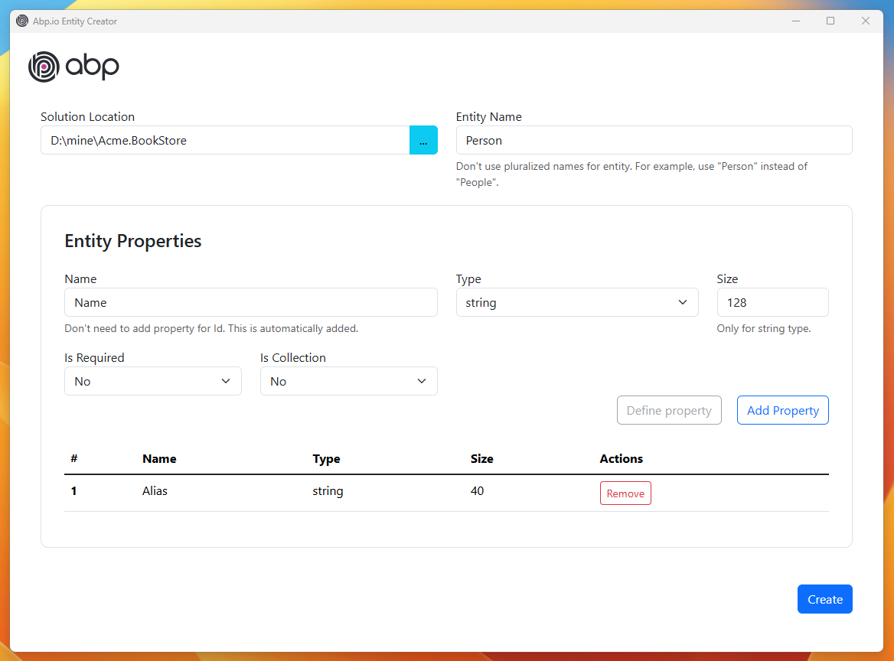
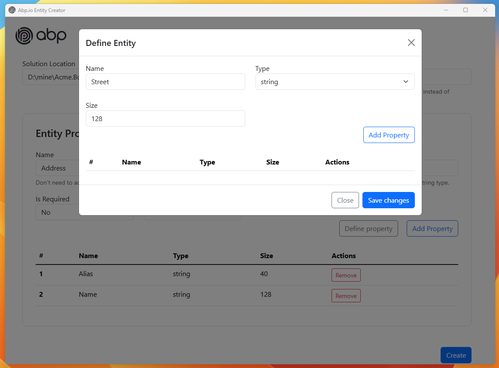

# Abp.io Entity Creator

This tool allows you to create new entities for solutions made with abp.io framework.

Its use is very simple and similar to the [AbpHelper (CLI) tool](https://github.com/EasyAbp/AbpHelper.CLI), with the difference that it is not necessary to model the entity in the solution and it also has a more friendly UI.

## How to Use

Run the application, enter the folder where your apb.io application is located.

Fill in the name of the entity and its properties.

To finish, click on the "Create" button to generate all classes and configurations for this entity

You can also configure a child entity (ValueObject or Entity) by clicking the "Define Property" button when choosing the property type as ValueObject or Entity

